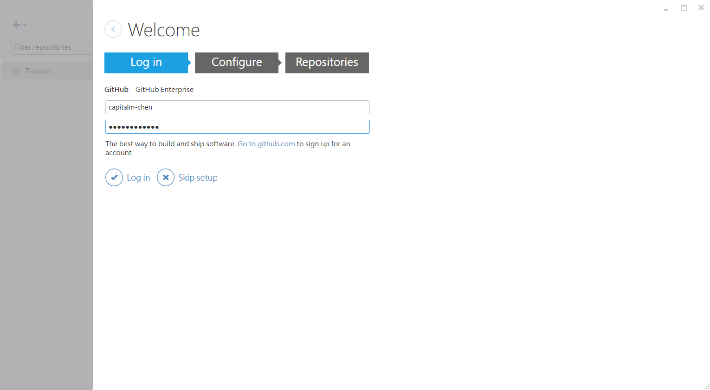
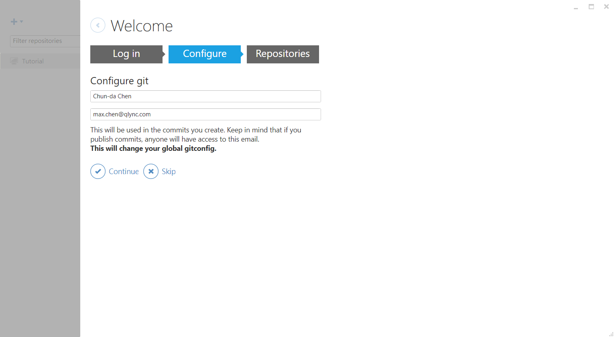
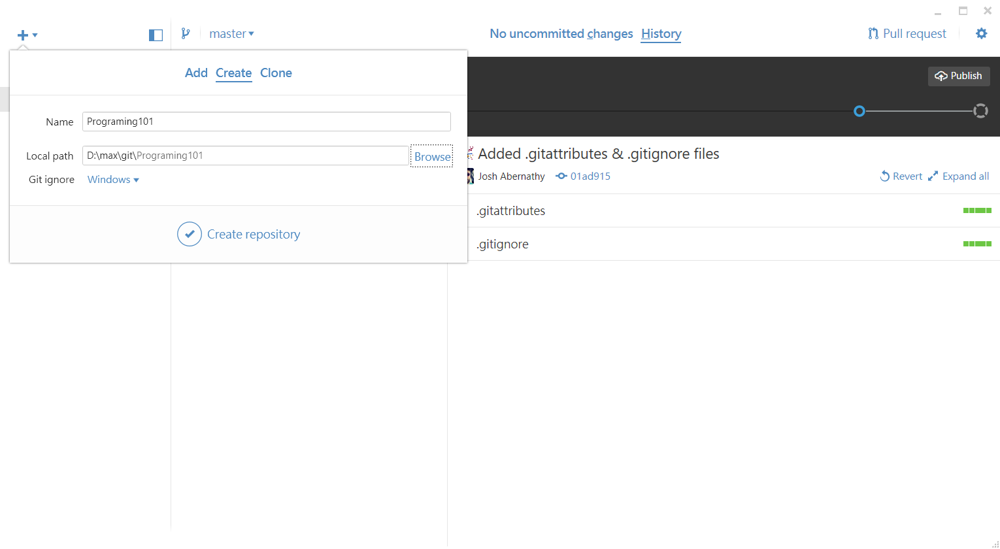
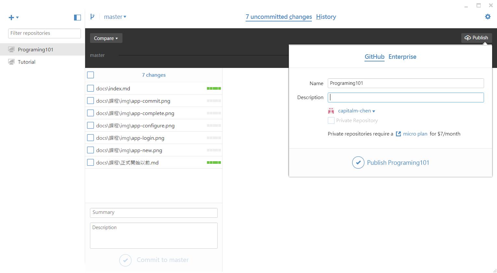
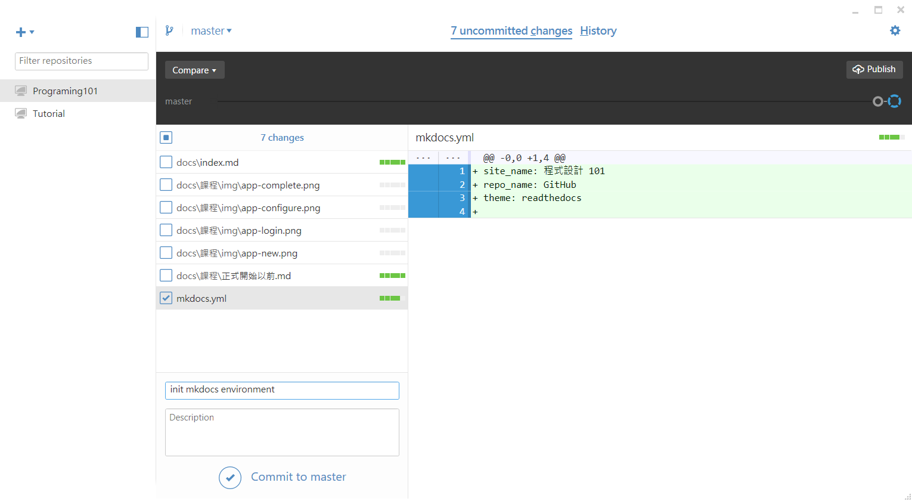
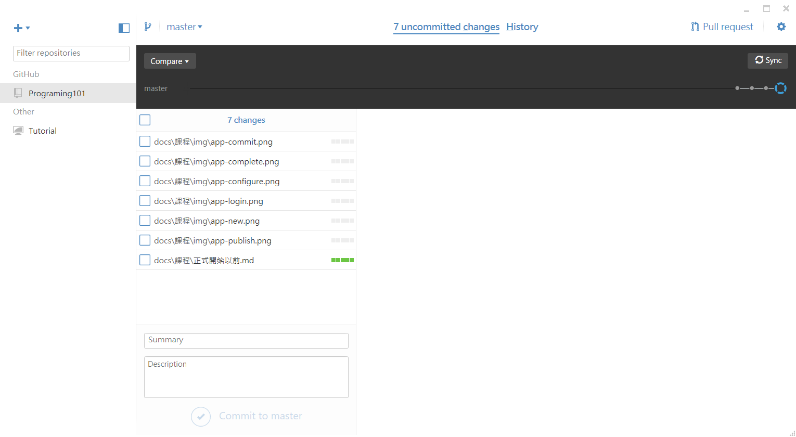

# 學習程式

1. 語法
2. 函式庫
3. 風格與習慣

# 使用 git

## 為什麼要版本控制?

* 追蹤修訂
* 錯誤排除
* 分工
* 責任分層

## GitHub 基本使用

1. 申請 [GitHub](https://github.com/) 帳號
2. 下載安裝 [GitHub App](https://desktop.github.com/)
3. 登入 GitHub
    
4. 設定資訊
    
5. 建立專案
    
6. 發布專案
    
7. 編輯專案
8. 提交更改
    
9. 同步專案
    

